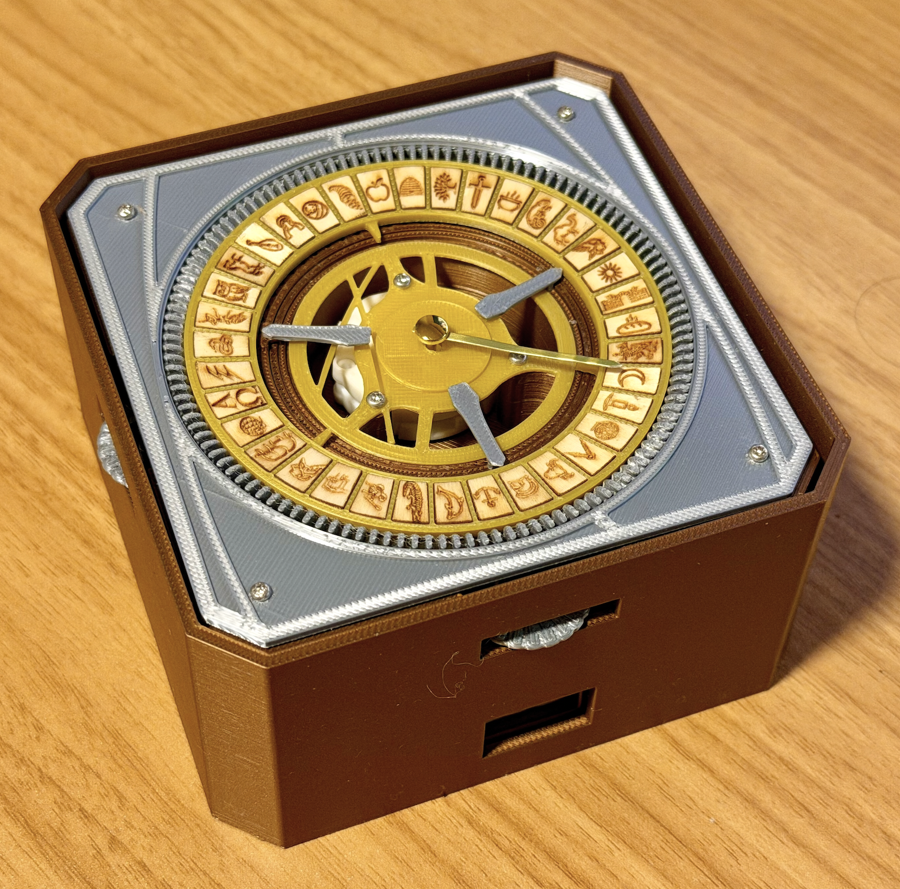
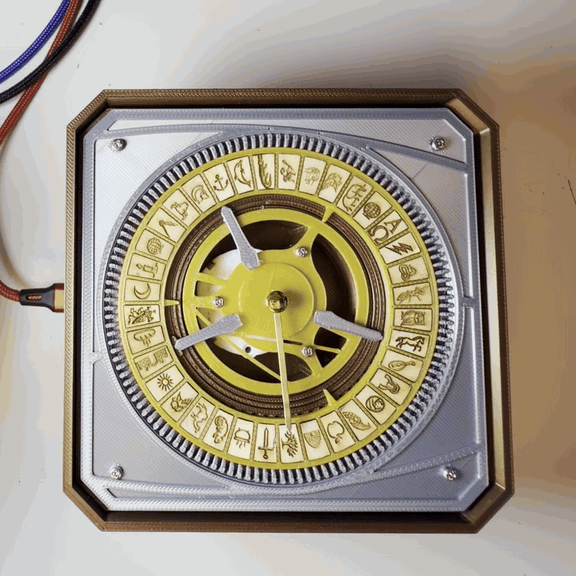

# Lyra's Alethiometer

 

An alethiometer is a divination device from the book series _His Dark Materials_ by Philip Pullman. This version is based on the one in [this YouTube video](https://www.youtube.com/watch?v=rpL9xWBeznU) which was created by Jamie of [Myth Made](https://www.youtube.com/@themythmade). That replica was in turn based on the prop from the BBC TV show adaptation of _His Dark Materials_.

This is an unofficial fan project and a collection of files intended to help others build an alethiometer. It is not super organized. Although I cannot guarantee any help, feel free to post questions in [r/AlethiometerBuild](https://www.reddit.com/r/AlethiometerBuild/)

## Sections
I've organized roughly by fabrication method

* [Electronics](electronics/)
* [Laser cutting](laser_cutting/)
* [3D printing](3d_printing/)

## Broad Assembly Steps

1. Print all the 3D printed parts
2. Laser engrave and cut all the symbol tiles and place them into the symbol holder
2. Drill existing holes on the motor plate to the right size
3. Drill the axle holes of the gears wider
3. With a soldering iron, install the heat set threaded inserts
2. Solder jumper wires to motor pins
3. Connect/solder wires to touch sensor module
2. Mount Nano to half size breadboard
3. Upload the Adruino sketch onto the Nano
4. Highly recommend wiring motor and touch sensor to the breadboard and testing it works before proceeding
3. Place motor plate support wall in the lower case, making sure windows line up
4. Stick the breadboard with Nano onto the floor of the case, aligning USB port with the window away from the hand dials
5. Stick the touch sensor module through the window that is on the same side as one of the hand dials, then wire up to breadboard
6. Carefully mount the motor onto the center of the motor plate, making sure the wires go through the rectangular cutouts and the motor pegs line up with the holes in the plate
7. Place the motor plate part way into the case, making sure the hand dial cutouts line up with the slots on the case. While holding, wire up the motor to the breadboard
8. Place the motor plate on top of the motor plate stand
9. Install the inner plate into the center
10. Stack the inner gears and place them around the inner ring of the motor plate
11. Install the gears, using M3 screws
12. Place the outer silver ring thing into the center of the motor plate, lining up the ledges
13. Place the symbol holder with tiles on top of the outer silver ring thing
14. Mount the outer dial face
15. Press the clock hand onto the shaft.
16. Centre the hand on the middle of a symbol
17. Plug in USB and touch the sensor.

## Misc Notes
* This project is provided as-is, without warranty of any kind. Use it at your own risk; I accept no liability for any damage or injury resulting from its use.
* This is an unofficial personal fan project, and not affiliated with the BBC, Philip Pullman, or Myth Made
* Ventilate when soldering, heat-set tips are hot, never leave the laser unattended, and small parts are unsuitable for young kids
* This build lacks a lid and is significantly taller than Jamie's version or the BBC version in order to accommodate the electronics I was able to use. The next version I intend to make it closer to the original size, and with a lid
* Due to lack of skills and access, metal parts were substituted with 3D printed parts

## Acknowledgements
* This project would not be possible without the [Myth Made alethiometer](https://www.youtube.com/watch?v=rpL9xWBeznU) built by Jamie, who made the plans publicly available [here](https://mythmade.gumroad.com/l/trhgos). They are available for free, but please consider chipping in what you can afford like I did to support her wonderful work!
* Claude by Anthropic and ChatGPT by OpenAI were generative AI tools used for tutoring, bouncing ideas around, reviewing, and generating code. All output was reviewed by me and tested on the hardware described here.

